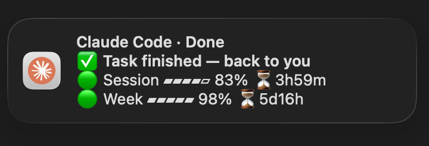

# Claude Chime 🔔

A friendly desktop chime for [Claude Code](https://claude.com/claude-code) on macOS.
When Claude finishes a task or needs your input, you get a native notification with:

- 🟠 **the real Claude icon** (not the generic script/terminal icon)
- 🔊 **a pleasant sound** (different for "done" vs. "waiting")
- ✅ / 👀 **an action icon** so you can tell "done" from "needs you" at a glance
- 📊 **a live usage gauge** — your **session** and **weekly** balance as a
  color-coded 🟢🟡🔴 bar, plus a ⏳ **countdown to when each limit resets**
- 🌐 **English + 中文**, auto-detected from your system language

Repeat chimes **replace** the previous one in Notification Center instead of
stacking up, so you only ever see the latest state.

<p align="center">
  
</p>

## Install

```bash
curl -fsSL https://raw.githubusercontent.com/wangpuv/claude-chime/main/install.sh | bash
```

That's it. New Claude Code sessions will chime. The installer:

1. installs [`terminal-notifier`](https://github.com/julienXX/terminal-notifier) via Homebrew (if missing),
2. drops the runtime into `~/.claude-chime`,
3. gives `terminal-notifier` the Claude icon,
4. adds two hooks to `~/.claude/settings.json` (`Stop` and `Notification`).

> **Requirements:** macOS + [Homebrew](https://brew.sh). Existing hooks are preserved; the installer is idempotent and safe to re-run.

## Updating

Re-run the same one-liner — that **is** the upgrade. It re-pulls the latest
runtime into `~/.claude-chime`, and because the installer is idempotent it won't
duplicate your hooks:

```bash
curl -fsSL https://raw.githubusercontent.com/wangpuv/claude-chime/main/install.sh | bash
```

Check what you're running with `~/.claude-chime/chime.sh --version`, and see
[CHANGELOG.md](CHANGELOG.md) for what changed.

## How the usage gauge works

The gauge shows your remaining limits, mirroring Claude Code's own `/usage`:

- **Session** = `100 − five_hour.utilization`, with a ⏳ countdown to its reset
  (hours + minutes)
- **Week** = `100 − seven_day.utilization`, with a ⏳ countdown to its reset
  (days + hours)

Each line gets a 🟢🟡🔴 dot (plenty / low / almost out) and a little `▰▰▰▰▱`
bar, so a chime reads like:

```
🟢 Session ▰▰▰▰▱ 78% ⏳3h59m
🟢 Week    ▰▰▰▰▰ 98% ⏳5d16h
```

(`<1m` / `<1h` once a reset is imminent, and a leading `~` if the number is
served from cache — see below.)

It reads your Claude Code OAuth token from the **macOS login Keychain**
(`Claude Code-credentials`) and queries the same endpoint `/usage` uses
(`https://api.anthropic.com/api/oauth/usage`).

- On first run, macOS may ask permission for the script to read that Keychain
  item — click **Always Allow**.
- This is **read-only** and uses **your own** token and account.
- The endpoint is **undocumented**; if Anthropic changes it, the gauge simply
  disappears and you still get the plain "done / waiting" chime. Nothing breaks.
- The endpoint rate-limits, and a "needs you" then "done" chime can fire seconds
  apart. To avoid a blank gauge on the second one, the last good response is
  cached for ~5 min in your temp dir and reused if a fetch is rate-limited — the
  ⏳ countdown is still recomputed live, so only the % may be a little stale.
- Don't want it? Set `CLAUDE_CHIME_NO_USAGE=1` (see below).

## Customize

The hooks call `chime.sh`. Tweak behavior with environment variables — either
edit the hook commands in `~/.claude/settings.json`, or export them globally.

| Variable | Default | What it does |
|---|---|---|
| `CLAUDE_CHIME_LANG` | `auto` | `zh`, `en`, or `auto` (from `$LANG`) |
| `CLAUDE_CHIME_SOUND_STOP` | `Glass` | Sound for "task done" |
| `CLAUDE_CHIME_SOUND_WAIT` | `Submarine` | Sound for "needs you" |
| `CLAUDE_CHIME_NO_USAGE` | `0` | Set `1` to hide the usage gauge |
| `CLAUDE_CHIME_ACTIVATE` | _(auto)_ | Bundle id to focus when the notification is clicked; defaults to the terminal that launched Claude Code |

Sound names are the files in `/System/Library/Sounds` (Glass, Submarine, Ping,
Hero, Funk, …).

### Clicking the notification

macOS always shows a default action button on the banner ("Show"). Claude Chime
binds it to bringing the terminal that launched Claude Code to the front (instead
of the no-op default). This is **best-effort**: it activates the terminal _app_,
but landing on the exact window/tab that's running your session requires the
terminal to expose window-level scripting (e.g. iTerm2 can select a session by
tty). Terminals without that — Apple Terminal, Kaku, and most others — just come
to the front showing their last-active window, so with several windows open the
click may not land on the right one. Override the target app with
`CLAUDE_CHIME_ACTIVATE` (a bundle id).

## Uninstall

```bash
curl -fsSL https://raw.githubusercontent.com/wangpuv/claude-chime/main/uninstall.sh | bash
```

Removes the hooks, restores the stock `terminal-notifier` icon, and deletes
`~/.claude-chime`. `terminal-notifier` itself is left installed
(`brew uninstall terminal-notifier` to remove it).

## How it fits together

```
Claude Code  ──(Stop / Notification hook)──▶  chime.sh ──▶ usage.py ──▶ /usage API
                                                  │
                                                  ▼
                                          terminal-notifier  ──▶  macOS notification
                                          (wearing the Claude icon)
```

## Contributing

Issues and PRs welcome — this is meant to be improved together. Good first ideas:
Linux/`notify-send` support, more languages, configurable messages.

## License

[Apache-2.0](LICENSE)

---

*Not affiliated with Anthropic. "Claude" and the Claude logo are trademarks of
Anthropic. The bundled icon is used to identify the Claude Code tool these
notifications come from.*
