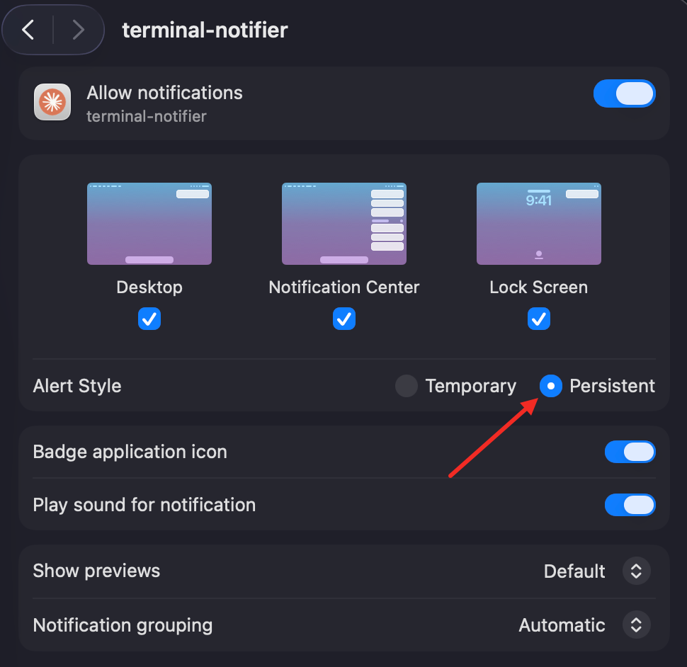

# Claude Chime 🔔

[English](README.md) · **中文**

给 macOS 上的 [Claude Code](https://claude.com/claude-code) 配一个友好的桌面提示音。
当 Claude 完成任务或需要你确认时，你会收到一条原生通知，包含：

- 🟠 **真正的 Claude 图标**（而不是通用的脚本/终端图标）
- 🔊 **悦耳的提示音**（「完成」和「等待」用不同的声音）
- ✅ / 👀 **动作图标**，一眼就能分清是「完成」还是「等你处理」
- 📊 **实时用量仪表盘**——你的**会话**和**每周**余量，用 🟢🟡🔴 配色的进度条
  显示，外加一个 ⏳ **距离各自额度重置的倒计时**
- 🌐 **中文 + English**，按系统语言自动切换

重复的通知会**替换**通知中心里的上一条，而不是层层堆叠，所以你看到的始终是最新状态。

<p align="center">
  
</p>

## 安装

```bash
curl -fsSL https://raw.githubusercontent.com/wangpuv/claude-chime/main/install.sh | bash
```

就这么简单。之后新的 Claude Code 会话就会发出提示音。安装脚本会：

1. 用 Homebrew 安装 [`terminal-notifier`](https://github.com/julienXX/terminal-notifier)（如果还没装），
2. 把运行时文件放进 `~/.claude-chime`，
3. 给 `terminal-notifier` 换上 Claude 图标，
4. 往 `~/.claude/settings.json` 里加两个 hook（`Stop` 和 `Notification`）。

> **环境要求：** macOS + [Homebrew](https://brew.sh)。已有的 hook 会被保留；安装脚本是幂等的，可放心重复运行。

## 升级

重新运行同一条命令——这**就是**升级方式。它会把最新的运行时重新拉到 `~/.claude-chime`，
而且因为安装脚本是幂等的，不会重复添加你的 hook：

```bash
curl -fsSL https://raw.githubusercontent.com/wangpuv/claude-chime/main/install.sh | bash
```

用 `~/.claude-chime/chime.sh --version` 查看当前版本，更新内容见
[CHANGELOG.md](CHANGELOG.md)。

## 用量仪表盘的原理

仪表盘显示你的剩余额度，和 Claude Code 自带的 `/usage` 一致：

- **会话** = `100 − five_hour.utilization`，附带一个 ⏳ 距离重置的倒计时（时 + 分）
- **每周** = `100 − seven_day.utilization`，附带一个 ⏳ 距离重置的倒计时（天 + 时）

每行前面有一个 🟢🟡🔴 圆点（充足 / 偏低 / 快用完）和一个小 `▰▰▰▰▱` 进度条。
标签用的是等宽 emoji——⏱️ 会话、📅 每周——这样在通知的非等宽字体里进度条也能对齐。
一条提示读起来像这样：

```
🟢 ⏱️ ▰▰▰▰▱ 78% ⏳3h59m
🟢 📅 ▰▰▰▰▰ 98% ⏳5d16h
```

（额度快重置时显示 `<1m` / `<1h`；如果数字来自缓存，前面会带一个 `~`——见下文。）

它从 **macOS 登录钥匙串**（`Claude Code-credentials`）读取你的 Claude Code OAuth
令牌，并查询 `/usage` 用的同一个接口（`https://api.anthropic.com/api/oauth/usage`）。

- 首次运行时，macOS 可能会询问是否允许脚本读取那个钥匙串项——点 **始终允许**。
- 这是**只读**的，用的是**你自己**的令牌和账号。
- 这个接口是**未公开**的；如果 Anthropic 改了它，仪表盘会直接消失，你仍然能收到
  普通的「完成 / 等待」提示。不会出任何错。
- 这个接口**限流很严**，而提示是事件驱动的，所以我们很「克制」地轮询它：温度目录里
  不到一分钟的缓存会被直接复用、**不再请求**，因此一连串提示最多每分钟发一次请求。
  只有缓存更旧时才会去取；如果取的时候被限流，就显示最近一次有效值（最多约 5 分钟旧），
  前面带一个 `~`。⏳ 倒计时始终是实时重新计算的，所以只有百分比可能略微滞后。
- 不想要它？设置 `CLAUDE_CHIME_NO_USAGE=1`（见下文）。

## 自定义

hook 调用的是 `chime.sh`。可以用环境变量调整行为——既可以改 `~/.claude/settings.json`
里的 hook 命令，也可以全局 export。

| 变量 | 默认值 | 作用 |
|---|---|---|
| `CLAUDE_CHIME_LANG` | `auto` | `zh`、`en` 或 `auto`（取自 `$LANG`） |
| `CLAUDE_CHIME_SOUND_STOP` | `Glass` | 「任务完成」的提示音 |
| `CLAUDE_CHIME_SOUND_WAIT` | `Submarine` | 「等你处理」的提示音 |
| `CLAUDE_CHIME_NO_USAGE` | `0` | 设为 `1` 隐藏用量仪表盘 |
| `CLAUDE_CHIME_ACTIVATE` | _(自动)_ | 点击通知时要聚焦的 App 的 bundle id；默认是启动 Claude Code 的那个终端 |

提示音的名字就是 `/System/Library/Sounds` 里的文件（Glass、Submarine、Ping、
Hero、Funk……）。

### 点击通知

macOS 总会在横幅上显示一个默认动作按钮（「显示」）。Claude Chime 把它绑定为把启动
Claude Code 的那个终端调到前台（而不是默认的什么都不做）。这是**尽力而为**的：它能
激活终端 _App_，但要精确落到正在跑你会话的那个窗口/标签页，需要终端暴露窗口级脚本能力
（比如 iTerm2 能按 tty 选中某个会话）。不具备这能力的终端——Apple Terminal、Kaku
以及大多数其他终端——只会带着上次活跃的窗口来到前台，所以开了好几个窗口时点击可能落不到
对的那个。可以用 `CLAUDE_CHIME_ACTIVATE`（一个 bundle id）覆盖目标 App。

### 让通知停留更久

提示在屏幕上停留多久并不由 Claude Chime 决定——这取决于 macOS 给发送方 App 设定的
**提醒样式**，而 macOS 只提供两种：

- **临时（Temporary）**（横幅）——几秒后自动滑走（默认）
- **持续（Persistent）**（提醒）——一直停留，直到你点击或手动关掉

要切换，打开 **系统设置 → 通知 → terminal-notifier**，把 **提醒样式（Alert Style）**
设为 **持续（Persistent）**：

<p align="center">
  
</p>

这对两种提示（完成、等你处理）是全局生效的，因为它们都由 `terminal-notifier` 发送。
没有中间档的时长——只有横幅和提醒两种。

## 卸载

```bash
curl -fsSL https://raw.githubusercontent.com/wangpuv/claude-chime/main/uninstall.sh | bash
```

会移除 hook、还原 `terminal-notifier` 的原版图标、删除 `~/.claude-chime`。
`terminal-notifier` 本身会保留（要删的话用 `brew uninstall terminal-notifier`）。

## 各部分如何协作

```
Claude Code  ──(Stop / Notification hook)──▶  chime.sh ──▶ usage.py ──▶ /usage 接口
                                                  │
                                                  ▼
                                          terminal-notifier  ──▶  macOS 通知
                                          （戴着 Claude 图标）
```

## 参与贡献

欢迎提 issue 和 PR——这个项目就是为了一起改进。一些适合上手的点子：
Linux/`notify-send` 支持、更多语言、可配置的消息文案。

## 许可

[Apache-2.0](LICENSE)

---

*与 Anthropic 无隶属关系。「Claude」和 Claude 标志是 Anthropic 的商标。内置图标仅用于
标识这些通知来自的 Claude Code 工具。*
